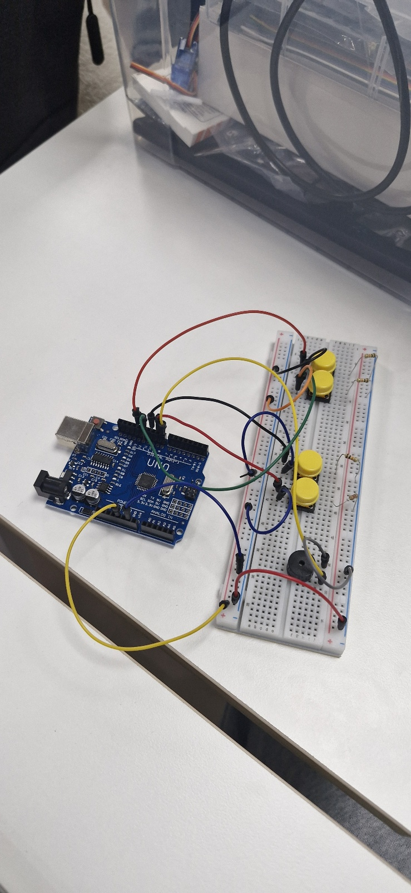

# jingu1115
# 안녕하세요
**저는 김진구 입니다**
제가 만든 아두이노는 피아노입니다.

작동원리는 버튼을 이용해 음정을 조절하고 부저를 울려 소리를 내는방식으로 만들었습니다.
소프트웨어는 변수를 이용해 음정을 조절하는 코드를 이용했습니다.
하드웨어에는 버튼4개와 부저 그리고 아두이노 우노를 사용했습니다.

  **실행**


```
int nTones[] = {130, 146, 164, 174, 195, 220, 246, 262, 294, 330, 349, 392, 440, 494, 523, 587, 659, 698, 783, 880, 987, 1046, 1174, 1318, 1396, 1567, 1760, 1975, 2093, 2349, 2637, 2793, 3136, 3620, 3951, 4186, 4698, 5274, 5587, 6271, 7040, 7902};

int num = 15;

#define C 9

#define D 10

#define up 12

#define down 13

#define buzzer 8


void setup() {

  // put your setup code here, to run once:
  
  Serial.begin(115200);
  
  pinMode(C, INPUT);
  
  pinMode(D, INPUT);
  
  pinMode(up, INPUT);
  
  pinMode(down, INPUT);
  
}

void loop() {

  // put your main code here, to run repeatedly:
  
  play_song();
  
}


void play_song(){

  if (digitalRead(C))
  
    tone(buzzer, nTones[num]);

  else if(digitalRead(D))
  
    tone(buzzer, nTones[num+1]);
    
  else if(digitalRead(up)){
  
    num += 2;
    
    delay(200);

  }
  
  else if(digitalRead(down)){
  
    num -= 2;
    
    delay(200);
    
  }
  
  else
  
    noTone(buzzer);
    
  Serial.println(num);
  
}
```

